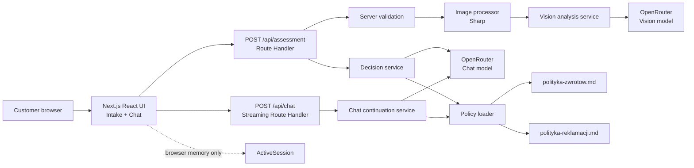
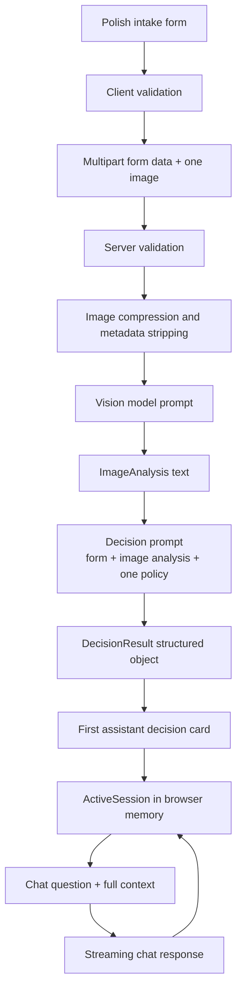
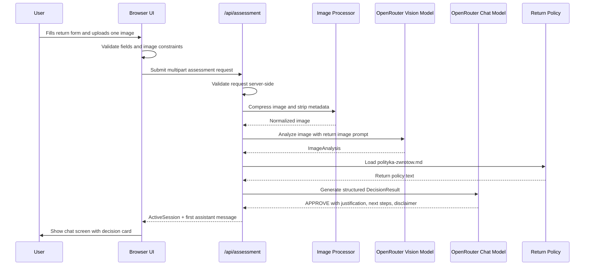
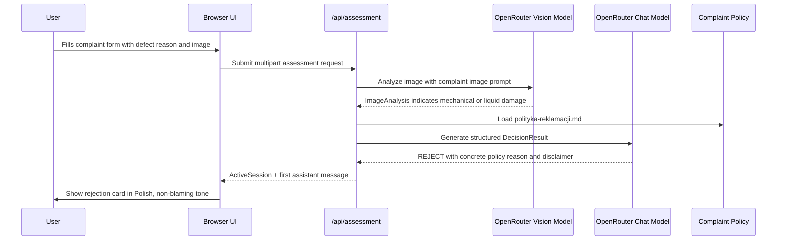
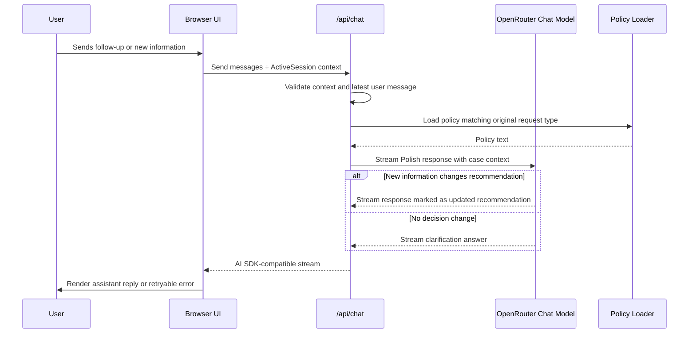
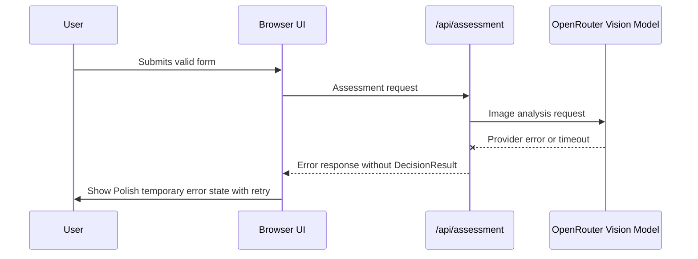

# ADR: Hardware Service Decision Copilot - Main Architecture

**Date:** 2026-06-18
**Status:** Accepted
**PRD:** `docs/PRD-Product-Requirements-Document.md`

---

## 1. Overview

Hardware Service Decision Copilot is an anonymous, customer-facing web MVP for a preliminary, non-binding assessment of consumer electronics returns and complaints. The user fills a short Polish intake form, uploads exactly one image, receives a policy-grounded decision card, and can continue in a chat thread for clarification or updated recommendations.

This ADR translates the PRD into implementation decisions for a new codebase. It defines the Next.js application architecture, module boundaries, API contracts, model/provider setup, session strategy, and testing expectations. More detailed decisions are split into focused ADRs:

| ADR | Scope |
|---|---|
| `docs/ADR/001-ai-decision-pipeline.md` | OpenRouter, Vercel AI SDK, prompts, model separation, structured decision output |
| `docs/ADR/002-frontend-session-ui.md` | Polish UX, AI SDK UI integration, client session state, design constraints |
| `docs/ADR/003-api-validation-image-handling.md` | API boundaries, server validation, image compression, privacy and error handling |

---

## 2. Resolved Clarifications

The `create-adr` skill requires clarifying answers before ADR creation. The following answers are resolved from the user request, PRD, repository instructions, and `.env.example` only:

| Question | Resolved answer |
|---|---|
| Framework, language, runtime | TypeScript on Node.js using Next.js 16 App Router. |
| Libraries already decided | Vercel AI SDK, AI SDK React/UI message primitives, OpenRouter as LLM provider. |
| Deployment constraints | MVP must run locally and be compatible with serverless deployment. No Docker requirement. |
| Persistence strategy | No database. Conversation state persists only in browser memory for the active session. |
| External APIs | OpenRouter only. It must provide a separate multimodal model for image analysis and a separate chat/text model for decisions and chat. |
| Scale expectations | Course MVP/PoC. Optimize for correctness, clarity, and low operational complexity, not high-volume production load. |
| Security requirements | No auth. Keep API keys server-only, do not log uploaded image content, do not persist images, and do not request sensitive personal data. |
| Testing requirements | TDD. Unit and integration tests mock external LLM APIs; E2E uses the real running app and, when executed by QA, the real configured stack. |
| Existing architecture | The app is not scaffolded yet. The repository already contains PRD, policy documents, design tokens, and app scaffolding notes. |

---

## 3. Context7 Library References

Implementing agents must use these handles to fetch current documentation before writing code. Do not search again unless a handle no longer resolves.

| Library | Context7 Handle | Used for |
|---|---|---|
| Next.js | `/vercel/next.js` | App Router, Route Handlers, Server/Client Components, environment variables |
| Vercel AI SDK | `/vercel/ai` | `streamText`, structured output, UI message streams, React chat hooks |
| OpenRouter | `/websites/openrouter_ai` | OpenRouter API, model IDs, multimodal messages, provider/base URL configuration |
| React | `/reactjs/react.dev` | Client components and session UI state |
| Tailwind CSS | `/tailwindlabs/tailwindcss.com` | Styling implementation using repository design tokens |
| shadcn/ui | `/shadcn-ui/ui` | Optional accessible primitives if the scaffold chooses shadcn components |
| Sharp | `/lovell/sharp` | Server-side image resize/compression before multimodal model calls |
| Vitest | `/vitest-dev/vitest` | Unit and integration tests |
| Playwright | `/microsoft/playwright` | Browser E2E tests |

Documentation research highlights:

- AI SDK supports Next.js Route Handlers for streaming chat responses and UI message streams.
- AI SDK v6 documentation recommends structured output through `generateText` with an output schema rather than legacy `generateObject`.
- AI SDK React supports client chat state and streaming status through `useChat`.
- Next.js App Router keeps server-only environment variables available in Route Handlers and Server Components.
- OpenRouter exposes an OpenAI-compatible API base URL and supports multimodal image messages for capable models.

---

## 4. System Architecture

### Architecture pattern

Use a single Next.js application with server-side Route Handlers and client-side React screens. The backend is not a separate service. The app is stateless on the server: every chat turn receives the active case context from the browser, and the server never stores sessions.

### Repository structure

The Next.js project is scaffolded inside `app/`. To avoid ambiguity with Next.js App Router's own route folder, the application should use a `src/` layout:

| Path | Purpose |
|---|---|
| `app/package.json` | Package root for the Next.js application |
| `app/src/app/` | Next.js App Router pages, layout, and route handlers |
| `app/src/components/` | Reusable UI components |
| `app/src/features/assessment/` | Intake form, validation, assessment flow, decision card |
| `app/src/features/chat/` | Chat screen and AI SDK UI integration |
| `app/src/server/ai/` | OpenRouter model configuration, prompts, AI orchestration |
| `app/src/server/policies/` | Server-only policy loader and policy text access |
| `app/src/server/validation/` | Shared server-side validation for form and chat requests |
| `app/src/server/image/` | Server-side image validation, metadata stripping, compression |
| `app/src/shared/` | Shared enums, data contracts, constants, Polish labels |
| `app/src/test/` | Test setup and test utilities |
| `docs/policies/` | Source-of-truth policy documents from the PRD |
| `assets/` | Design tokens, logo, favicon, reference image |

Policy documents remain source-of-truth files in `docs/policies/`. The Next.js server layer must load those exact documents or a build-time copied read-only equivalent. Runtime prompts must identify which policy file was used so tests can verify correct policy selection.

### Technology stack

| Layer | Technology | Reason |
|---|---|---|
| Application framework | Next.js 16 App Router | Single deployable TypeScript app with server routes and React UI |
| Frontend | React + AI SDK React/UI primitives | Supports a form-to-chat workflow and streaming chat state |
| Styling | Tailwind CSS using `assets/design-tokens.json` | Matches the existing design guidelines and keeps UI work fast for MVP |
| Backend API | Next.js Route Handlers | Explicit HTTP contracts for multipart assessment and streaming chat |
| AI orchestration | Vercel AI SDK | Unified model calls, structured output, streaming, and UI message compatibility |
| LLM provider | OpenRouter | Single provider for multiple model families and separate vision/chat model IDs |
| Image processing | Sharp | Reliable server-side resize/compression and metadata stripping |
| Persistence | Browser memory only | Matches PRD out-of-scope rules for database/session persistence |
| Testing | Vitest + Testing Library + Playwright | Unit/integration and browser E2E coverage aligned with repository TDD rules |

---

## 5. Module Structure & Dependencies

Dependency direction is strictly layered:

`UI features -> shared contracts -> route handlers -> server domain services -> external OpenRouter`

No server module may import React components. Shared contracts may not import server-only modules.

### Modules

| Module | Responsibility | Depends on | Used by |
|---|---|---|---|
| `shared/contracts` | Request type, equipment category, decision enum, DTO shapes | None | UI, route handlers, tests |
| `shared/polish-copy` | User-facing Polish labels and fixed disclaimer text | Shared contracts | UI, prompt assembly tests |
| `features/assessment` | Intake form, client validation, image picker, submit flow | Shared contracts, UI primitives | Main page |
| `features/chat` | Chat thread, composer, AI SDK React integration, retry handling | Shared contracts, AI SDK React | Main page |
| `server/validation` | Server-side validation for assessment and chat requests | Shared contracts | Route handlers |
| `server/image` | MIME/signature checks, size checks, compression, metadata removal | Sharp | Assessment route |
| `server/policies` | Loads return and complaint policy documents | File system/server runtime | AI orchestration |
| `server/ai/prompts` | Prompt contracts for image analysis, decision, and chat continuation | Shared contracts, policy text | AI orchestration |
| `server/ai/openrouter` | OpenRouter model/provider configuration | Environment variables, AI SDK | AI orchestration |
| `server/ai/assessment` | Orchestrates vision analysis and structured decision | Validation, image, policies, prompts, OpenRouter | Assessment route |
| `app/api/assessment` | Multipart assessment endpoint | Server validation, image, AI assessment | UI submit flow |
| `app/api/chat` | Streaming chat endpoint | Server validation, policy/chat prompt, OpenRouter | AI SDK React chat |

---

## 6. Data Models

### RequestType

Purpose: distinguishes return and complaint logic.

Allowed values:

- `RETURN`
- `COMPLAINT`

Displayed in Polish as `Zwrot` and `Reklamacja`.

### EquipmentCategory

Purpose: fixed PRD category list.

Allowed labels:

- `Smartfon`
- `Laptop`
- `Tablet`
- `Telewizor/Monitor`
- `Audio/Słuchawki`
- `Smartwatch/Wearable`
- `Aparat/Kamera`
- `Konsola do gier`
- `Sprzęt AGD`
- `Inne`

### AssessmentInput

Purpose: normalized user submission after validation.

Fields:

| Field | Type | Constraints |
|---|---|---|
| `requestType` | enum | Required; `RETURN` or `COMPLAINT` |
| `equipmentCategory` | enum label | Required; one of the PRD categories |
| `equipmentName` | string | Required; trimmed non-empty |
| `purchaseDate` | ISO date string | Required; must not be future relative to server date |
| `reason` | string | Required for `COMPLAINT`; optional for `RETURN`; always trimmed |
| `image` | binary file | Required; exactly one file; JPEG, PNG, or WebP; max 10 MB before compression |

Persistence: browser memory during form fill; server memory only for request duration.

### ImageAnalysis

Purpose: textual, model-generated description of the uploaded image.

Fields:

| Field | Type | Purpose |
|---|---|---|
| `requestType` | enum | Confirms which image-analysis prompt was used |
| `summary` | string | Plain Polish description of visible device state |
| `visibleDamage` | string | Visible damage or `none observed` equivalent |
| `likelyCause` | string | Manufacturing, user-caused/mechanical, liquid, wear, unclear, or not applicable |
| `resaleCondition` | string | Relevant primarily for returns |
| `qualityIssues` | string array | Blur, wrong subject, insufficient detail, glare, cropped image, etc. |
| `confidence` | low/medium/high | Model confidence in image interpretation |

Persistence: returned to client as part of active session context; never stored on server.

### DecisionResult

Purpose: structured recommendation used to render the first assistant message.

Fields:

| Field | Type | Constraints |
|---|---|---|
| `decision` | enum | Exactly one of `APPROVE`, `REJECT`, `NEEDS_MORE_INFO`, `CONDITIONAL`, `ESCALATE` |
| `summary` | string | One-sentence Polish outcome summary |
| `justification` | string | Polish explanation tied to concrete policy reason |
| `policyReferences` | string array | Specific policy section labels or rule summaries used |
| `missingInformation` | string array | Required when decision is `NEEDS_MORE_INFO`; empty otherwise |
| `conditions` | string array | Required when decision is `CONDITIONAL`; empty otherwise |
| `nextSteps` | string array | Concrete Polish next steps |
| `disclaimer` | string | Must include the mandatory non-binding disclaimer in Polish |
| `confidence` | low/medium/high | Agent confidence; low confidence should drive `ESCALATE` or `NEEDS_MORE_INFO` |

Persistence: browser memory for active session.

### ActiveSession

Purpose: complete context needed for chat continuation.

Fields:

| Field | Type | Purpose |
|---|---|---|
| `sessionId` | opaque string | Client-visible identifier only; not resolvable server-side |
| `assessmentInput` | AssessmentInput without image binary | Supplies case facts |
| `imageAnalysis` | ImageAnalysis | Supplies retained image interpretation |
| `initialDecision` | DecisionResult | Supplies first decision state |
| `firstAssistantMessage` | string or structured UI message | Supplies initial chat message |
| `messages` | UI message array | Current chat history |

Persistence: browser memory only. Reload or `new request` clears it.

---

## 7. API / Interface Contracts

Detailed contracts are defined in `docs/ADR/003-api-validation-image-handling.md`; this section records the system-level boundaries.

### `POST /api/assessment`

Purpose: validates the intake submission, compresses the image, runs image analysis, runs decision generation, and returns the initial active session data.

Input:

- `multipart/form-data`
- exactly one image file
- text fields matching `AssessmentInput`

Output on success:

- `ActiveSession` without chat continuation messages beyond the first assistant message
- HTTP 200

Error cases:

- HTTP 400 for validation errors
- HTTP 413 or 400-equivalent typed error for file over 10 MB
- HTTP 415 or 400-equivalent typed error for unsupported image type
- HTTP 502/503 for OpenRouter/model failures
- HTTP 500 for unexpected server errors

No partial decision is returned when the image analysis or decision model call fails.

### `POST /api/chat`

Purpose: streams a Polish assistant response for follow-up questions using the complete active session context.

Input:

- JSON body containing `ActiveSession` context without image binary
- UI message history or equivalent AI SDK-compatible messages
- latest user message

Output:

- AI SDK-compatible streamed assistant message

Error cases:

- HTTP 400 for missing/invalid session context
- HTTP 502/503 for OpenRouter/model failures
- streaming error state exposed to the client for retry

### Policy loader interface

Purpose: selects the correct source policy document.

Contract:

- `RETURN` always uses `docs/policies/polityka-zwrotow.md`
- `COMPLAINT` always uses `docs/policies/polityka-reklamacji.md`
- no request may combine both policies unless the chat user explicitly changes request type and the app starts a new assessment

---

## 8. Environment Variables

The ADR intentionally uses `.env.example` only. The real `.env` must not be read by agents.

Existing variables in `.env.example`:

| Variable | Purpose | Required | Example value |
|---|---|---|---|
| `OPENAI_API_KEY` | Legacy/direct OpenAI key from template | No for this ADR | `sk-your-openai-api-key-here` |
| `OPENROUTER_API_KEY` | OpenRouter API key | Yes | `sk-or-your-openrouter-key-here` |
| `OPENROUTER_BASE_URL` | OpenRouter OpenAI-compatible base URL | Yes, defaultable | `https://openrouter.ai/api/v1` |
| `OPENROUTER_MODEL` | Existing single-model fallback from template | Transitional only | `openai/gpt-5.4-mini` |
| `CONTEXT7_API_KEY` | Optional docs-aware coding support | No at runtime | `ctx7...` |
| `PORT` | Local dev server port | No | `3000` |

Required ADR extension for separate models:

| Variable | Purpose | Required | Example value |
|---|---|---|---|
| `OPENROUTER_CHAT_MODEL` | Text/chat/decision model used for structured decision and chat continuation | Yes | `openai/gpt-5.4-mini` |
| `OPENROUTER_VISION_MODEL` | Multimodal model used only for image analysis | Yes | `openai/gpt-5.4` |
| `OPENROUTER_APP_URL` | Optional OpenRouter attribution referer | No | `http://localhost:3000` |
| `OPENROUTER_APP_TITLE` | Optional OpenRouter attribution title | No | `Hardware Service Decision Copilot` |

Implementation rule: `OPENROUTER_CHAT_MODEL` and `OPENROUTER_VISION_MODEL` are the primary configuration. `OPENROUTER_MODEL` may be supported as a temporary fallback during scaffolding, but tests must cover the separate-model contract.

---

## 9. Technical Decisions

### Use a single Next.js application

**Status:** Accepted
**Date:** 2026-06-18

**Context:** The PRD defines one customer-facing web flow with a small number of server-side AI calls. A separate backend would add deployment and testing overhead without providing value for the MVP.

**Decision:** Implement frontend and backend in one Next.js 16 App Router application under `app/`.

**Rejected alternatives:**

- Separate Express API and Vite frontend: increases cross-service coordination and deployment steps.
- Backend-only prototype: cannot satisfy the PRD's responsive form/chat UX acceptance criteria.

**Consequences:**

- (+) One codebase, one dev server, one deployment target.
- (+) Route Handlers can keep OpenRouter credentials server-side.
- (-) Serverless runtime limits must be considered for image processing and streaming.

**Review trigger:** Revisit if the application adds persistent audit logs, staff workflows, or high-volume processing.

### Keep the server stateless

**Status:** Accepted
**Date:** 2026-06-18

**Context:** The PRD explicitly excludes session persistence in a database and says context persists only during the active browser session.

**Decision:** Store `ActiveSession` only in browser memory. Each chat request sends the full non-binary case context to the server.

**Rejected alternatives:**

- SQLite session database: explicitly out of scope.
- Server memory session store: unreliable in serverless environments and lost across restarts.

**Consequences:**

- (+) Simple, PRD-compliant architecture.
- (+) No storage of uploaded images or customer case history.
- (-) Reload clears the conversation by design.
- (-) Chat request payloads include repeated context.

**Review trigger:** Revisit if session resume, audit history, staff handoff, or analytics enter scope.

### Use two OpenRouter model roles

**Status:** Accepted
**Date:** 2026-06-18

**Context:** The user explicitly requires a separate multimodal LLM for image analysis and a separate LLM for chat/text/decision.

**Decision:** Configure `OPENROUTER_VISION_MODEL` for image analysis and `OPENROUTER_CHAT_MODEL` for both structured initial decisions and chat continuation.

**Rejected alternatives:**

- One model for every task: violates the requirement and makes cost/quality tuning harder.
- Direct OpenAI provider: contradicts the requested OpenRouter provider choice.

**Consequences:**

- (+) Vision and reasoning quality/cost can be tuned independently.
- (+) Tests can assert correct model routing.
- (-) `.env.example` must be extended because it currently has only `OPENROUTER_MODEL`.

**Review trigger:** Revisit if OpenRouter model availability or pricing makes separate models impractical.

### Enforce structured initial decisions

**Status:** Accepted
**Date:** 2026-06-18

**Context:** The PRD requires exactly one decision from a fixed set, mandatory policy-grounded justification, and a mandatory disclaimer. Free-form text is too weak for reliable UI rendering and testing.

**Decision:** The initial decision call must return a typed structured object matching `DecisionResult`. The UI renders the first decision card from that object, not by parsing free-form prose.

**Rejected alternatives:**

- Free-form model response only: cannot reliably enforce the decision enum.
- Hard-coded rules only: cannot combine nuanced image analysis, form context, and policy reasoning.

**Consequences:**

- (+) Decision outcomes are testable and visually renderable.
- (+) Invalid model output can be rejected without fabricating a decision.
- (-) Prompt/schema design requires focused tests.

**Review trigger:** Revisit if future model/provider constraints prevent reliable structured output.

### Use direct policy injection, not RAG

**Status:** Accepted
**Date:** 2026-06-18

**Context:** The PRD says there is no RAG knowledge base. The two policy documents are small and are the source of truth.

**Decision:** Inject exactly one relevant policy document into the decision/chat prompt based on `requestType`.

**Rejected alternatives:**

- Vector search/RAG: explicitly out of scope and unnecessary for two documents.
- Embedding policy summaries only: risks dropping rules needed for concrete policy justification.

**Consequences:**

- (+) Simple and auditable source-of-truth behavior.
- (+) Tests can verify exact policy selection by request type.
- (-) Prompt size grows if policy documents become large.

**Review trigger:** Revisit if policy documents exceed model context budgets or more than five policy sources are added.

---

## 10. Diagrams

### 10.1 Architecture / Component Diagram

### 10.2 Data Flow Diagram

### 10.3 Sequence Diagrams

#### Return assessment approved

#### Complaint assessment rejected

#### Chat continuation and possible revision

#### AI service failure

---

## 11. Testing Strategy

### Philosophy

Implementation must follow TDD. Tests start from PRD acceptance criteria and ADR contracts, then production code is added only until the tests pass. External LLM calls are mocked in unit and integration tests; E2E tests are run against the real application stack when the required keys are available.

### Test layers

| Layer | Type | Scope | Tools |
|---|---|---|---|
| Unit | Deterministic module tests | Validation, policy selection, decision schema parsing, prompt selection, Polish copy constants | Vitest |
| Component | UI behavior tests | Intake form states, file picker behavior, decision card rendering, retry states | Testing Library + Vitest |
| Integration | Route Handler tests | `/api/assessment` and `/api/chat` with mocked OpenRouter responses | Vitest |
| E2E | Browser workflow tests | Form to chat, retry states, new request clearing, responsive layout | Playwright |

### Key test scenarios

- Return happy path: valid return submission yields `APPROVE`, uses return policy, and renders the first chat message in the required order.
- Complaint happy path: valid complaint with defect reason yields a policy-grounded complaint decision and uses complaint policy only.
- Complaint missing reason: client and server both reject the submission with Polish inline error text.
- Unsupported image type: server rejects any non-JPEG/PNG/WebP file and names accepted formats.
- Oversized image: server rejects files larger than 10 MB before compression.
- Image service failure: no decision is returned and the UI shows retryable error state.
- Invalid decision output: malformed or out-of-enum model output is rejected and not rendered as a decision.
- Chat context: every chat request includes form data, image analysis, and first decision context.
- Off-topic chat: assistant declines unrelated tasks and redirects to the case.
- New request: clears active session and returns to the empty form.

### Technical acceptance criteria

- TAC-000-01: The application has exactly two public server endpoints for the MVP flow: `/api/assessment` and `/api/chat`.
- TAC-000-02: Server code never reads or exposes OpenRouter keys in client bundles.
- TAC-000-03: Initial decisions are rendered only from a valid `DecisionResult` object with exactly one allowed decision enum value.
- TAC-000-04: The server never persists uploaded images, image bytes, or chat transcripts.
- TAC-000-05: `RETURN` requests use only `polityka-zwrotow.md`; `COMPLAINT` requests use only `polityka-reklamacji.md`.
- TAC-000-06: `OPENROUTER_VISION_MODEL` and `OPENROUTER_CHAT_MODEL` are both used in tests proving separate model routing.
- TAC-000-07: All user-facing strings introduced by the app are Polish.
- TAC-000-08: `npm test`, `npm run lint`, `npm run build`, and a local app start command pass for the changed implementation scope before commit.
