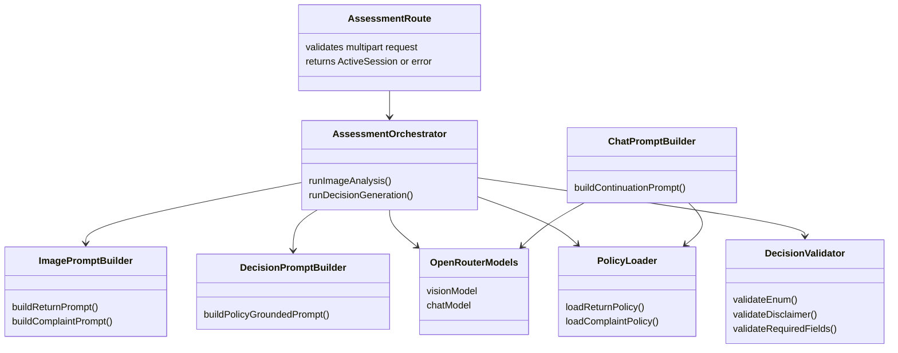
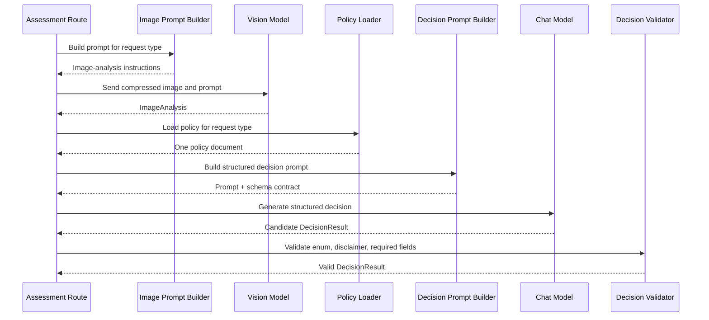
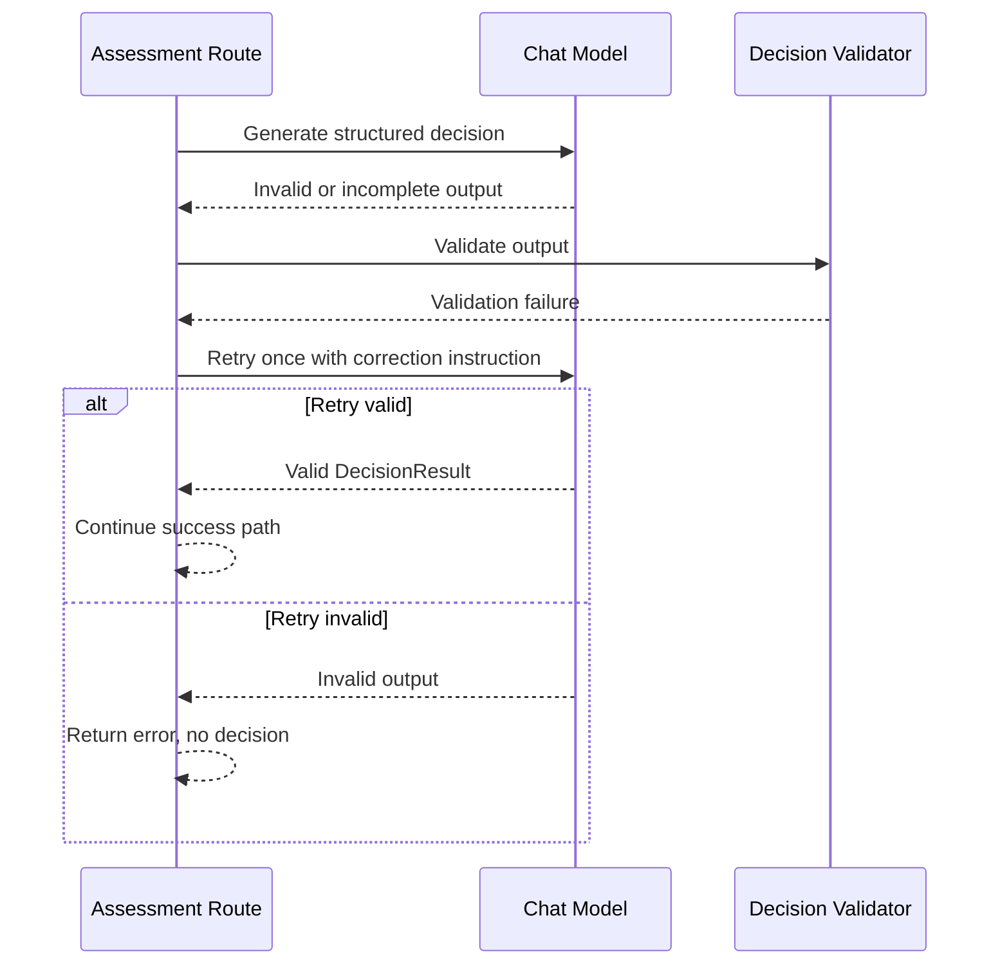
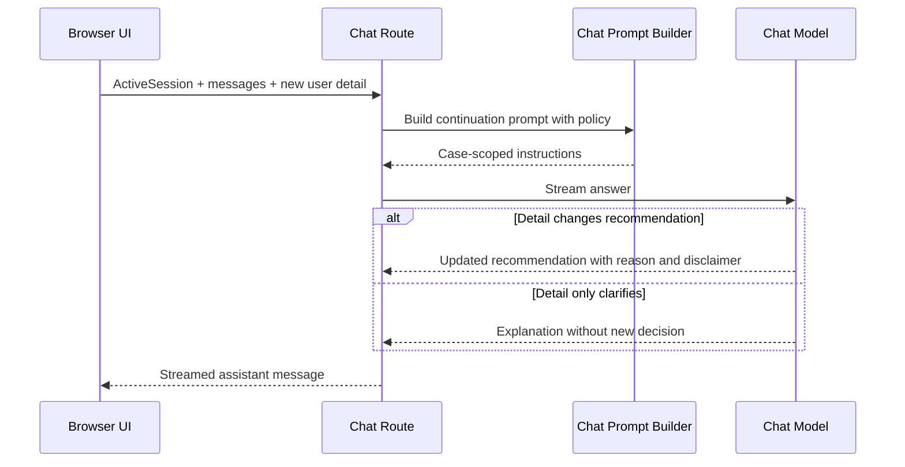

# ADR-001: AI Decision Pipeline

**Date:** 2026-06-18
**Status:** Accepted
**Relates to:** `docs/ADR/000-main-architecture.md`

---

## 1. Scope

This ADR covers the AI orchestration for image analysis, initial decision generation, and chat continuation. It defines model roles, prompt responsibilities, structured output requirements, policy grounding, and failure behavior.

It does not cover detailed UI layout, file upload widgets, or server-side multipart parsing. Those are covered in `docs/ADR/002-frontend-session-ui.md` and `docs/ADR/003-api-validation-image-handling.md`.

---

## 2. Context7 References

| Library | Context7 Handle | Used for |
|---|---|---|
| Vercel AI SDK | `/vercel/ai` | Model calls, structured output, streaming chat, UI message stream compatibility |
| OpenRouter | `/websites/openrouter_ai` | Provider configuration, model IDs, multimodal image input |
| Next.js | `/vercel/next.js` | Server-side Route Handler runtime and environment variables |

---

## 3. Component Design

### Components

| Component | Responsibility |
|---|---|
| Model configuration | Reads server-only OpenRouter env vars and exposes the vision model and chat model to server code |
| Image analysis prompt builder | Selects the return or complaint image-analysis prompt and includes only image-specific task instructions |
| Decision prompt builder | Combines form facts, image analysis, one policy document, decision enum rules, disclaimer requirement, and output schema |
| Chat prompt builder | Combines active session context, selected policy document, conversation history, off-topic boundary, and revision rules |
| Assessment orchestrator | Calls vision analysis first, then decision generation; never calls decision generation when image analysis fails |
| Decision validator | Accepts only valid structured `DecisionResult`; rejects missing disclaimer, missing justification, or invalid enum |
| Error mapper | Converts model/provider failures into typed API errors without leaking provider details or fabricating decisions |

### Dependency direction

`Route Handler -> Assessment Orchestrator -> Prompt Builders -> Model Configuration -> OpenRouter`

Prompt builders depend on shared contracts and policy text. They must not depend on React or route-layer code.

---

## 4. Data Structures

### ImageAnalysis prompt result

The image model must produce a plain-language analysis that can be retained as text in the session. It must include:

- visible device category or mismatch if the image does not show the expected subject
- visible condition signals
- image quality issues
- damage type, if visible
- likely cause for complaint cases: manufacturing defect, mechanical/user-caused, liquid, natural wear, unclear
- resale condition for return cases
- confidence level

The image model must not produce the final return/complaint decision. It provides evidence only.

### DecisionResult

The decision model must produce exactly one result matching the contract from ADR-000:

- `APPROVE`
- `REJECT`
- `NEEDS_MORE_INFO`
- `CONDITIONAL`
- `ESCALATE`

Every decision result must include:

- Polish summary
- policy-grounded justification
- relevant policy references or rule summaries
- next steps
- mandatory non-binding disclaimer
- confidence

Additional requirements by decision:

| Decision | Required fields |
|---|---|
| `NEEDS_MORE_INFO` | non-empty `missingInformation`; no approval/rejection language |
| `CONDITIONAL` | non-empty `conditions`; qualitative only for value deduction |
| `ESCALATE` | reason for escalation and what happens next; no real ticket/handoff claim |
| `REJECT` | concrete failed rule and any remaining option, such as paid repair |
| `APPROVE` | qualifying policy reason and next step, without guaranteeing final outcome |

### ChatContinuationContext

Each chat model call receives:

- original `AssessmentInput` without image bytes
- `ImageAnalysis`
- `DecisionResult`
- first assistant decision message
- full current message history
- policy text for the original request type

The model must not be given the original image bytes during chat continuation.

---

## 5. Interface Contracts

### Vision analysis call

Input:

- compressed image bytes or data URL acceptable to the selected OpenRouter multimodal model
- request type
- equipment category and model name
- request-specific image-analysis instructions

Output:

- `ImageAnalysis` textual evidence object

Failure behavior:

- Provider/network error returns an API error; no decision is generated.
- Invalid or unusable image evidence may return `ImageAnalysis` with quality issues, allowing the decision model to produce `NEEDS_MORE_INFO`.
- If the image model cannot produce any usable description, the assessment fails with a retryable error rather than fabricating evidence.

### Decision generation call

Input:

- normalized form data
- `ImageAnalysis`
- exactly one policy document selected by request type
- decision enum and communication rules
- structured output schema

Output:

- valid `DecisionResult`

Failure behavior:

- Invalid structured output is retried at most once.
- If still invalid, the API returns an error state and no decision.
- The server must not coerce an invalid free-form answer into a decision.

### Chat continuation call

Input:

- `ChatContinuationContext`
- latest user message
- conversation history

Output:

- streamed Polish assistant message

Failure behavior:

- Provider errors surface as a retryable chat turn error.
- A failed chat turn must not mutate the active session as if the assistant replied.

---

## 6. Technical Decisions

### Use OpenRouter through the Vercel AI SDK

**Status:** Accepted
**Date:** 2026-06-18

**Context:** The implementation must use OpenRouter as the LLM provider and Vercel AI SDK as the model orchestration layer.

**Decision:** Configure AI SDK-compatible OpenRouter access on the server using `OPENROUTER_API_KEY`, `OPENROUTER_BASE_URL`, `OPENROUTER_CHAT_MODEL`, and `OPENROUTER_VISION_MODEL`.

**Rejected alternatives:**

- Direct provider-specific SDK only: would bypass the requested AI SDK architecture and UI stream compatibility.
- Client-side model calls: would expose API keys and uploaded image data paths to the browser.

**Consequences:**

- (+) One provider interface can access both vision and text models.
- (+) AI SDK streaming and structured output fit the UI flow.
- (-) Implementers must validate the exact provider package/API against current AI SDK and OpenRouter docs before coding.

**Review trigger:** Revisit if the AI SDK/OpenRouter integration lacks required multimodal support for the selected vision model.

### Keep image analysis and decision generation as separate calls

**Status:** Accepted
**Date:** 2026-06-18

**Context:** The PRD requires a multimodal model to analyze the image and a reasoning agent to combine image description, form data, and policy.

**Decision:** The pipeline is always two-stage for initial assessment: image analysis first, structured decision second.

**Rejected alternatives:**

- Single multimodal decision call: hides image evidence and weakens chat context retention.
- Text-only decision without image analysis: violates PRD acceptance criteria AC-12 through AC-14.

**Consequences:**

- (+) Image interpretation is retained as explicit chat context.
- (+) Decision prompt can stay policy-focused and schema-constrained.
- (-) Two model calls increase latency and provider failure surface.

**Review trigger:** Revisit if latency exceeds acceptable MVP UX thresholds or if OpenRouter model routing introduces frequent failures.

### Use request-specific image prompts

**Status:** Accepted
**Date:** 2026-06-18

**Context:** Return and complaint image tasks are materially different. Returns focus on resale condition; complaints focus on defect/damage cause.

**Decision:** Use separate image-analysis prompt contracts:

- Return prompt: assess visible use, damage, completeness indicators, resale-as-new blockers, and image quality.
- Complaint prompt: assess visible damage, damage type, likely cause, defect indicators, liquid/mechanical signs, and image quality.

**Rejected alternatives:**

- One generic image prompt: risks missing request-specific evidence.
- Let decision model infer image task from raw image: contradicts the explicit two-stage PRD flow.

**Consequences:**

- (+) Tests can prove correct prompt selection.
- (+) Image output contains evidence relevant to the policy branch.
- (-) Prompt updates must keep both branches aligned with policy changes.

**Review trigger:** Revisit if a future unified prompt demonstrably matches both branches in tests.

### Use structured output for the first decision

**Status:** Accepted
**Date:** 2026-06-18

**Context:** The UI needs a visually distinguishable decision status, ordered sections, and deterministic error handling.

**Decision:** Generate a validated structured decision object for the first decision. The assistant message is rendered from this object.

**Rejected alternatives:**

- Parse Markdown from the model: brittle and hard to test.
- Hard-code all decision text from rules: loses nuanced explanation from image/form/policy reasoning.

**Consequences:**

- (+) Decision enum, disclaimer, missing-info fields, and next steps are enforceable.
- (+) UI can render consistent status labels.
- (-) Requires schema validation and invalid-output handling.

**Review trigger:** Revisit if the selected chat model cannot reliably produce structured output under tests.

### Refuse off-topic chat requests

**Status:** Accepted
**Date:** 2026-06-18

**Context:** The PRD prohibits unrelated tasks and legal advice. The chat is for clarifying the active return/complaint case only.

**Decision:** The chat prompt must instruct the assistant to decline unrelated tasks in Polish and redirect to the case.

**Rejected alternatives:**

- General-purpose assistant behavior: violates AC-26 and increases risk.
- Client-side keyword filtering only: too brittle and easy to bypass.

**Consequences:**

- (+) Keeps scope and safety clear for an MVP.
- (-) Some borderline customer-service questions may be declined conservatively.

**Review trigger:** Revisit when the app adds broader customer support capabilities.

---

## 7. Diagrams

### Component / Class Diagram

### Sequence Diagrams

#### Initial assessment pipeline

#### Invalid model output

#### Chat revision path

---

## 8. Testing Strategy

### Test scenarios for this area

| Scenario | Type | Input | Expected output | Edge cases |
|---|---|---|---|---|
| Return image prompt selection | Unit | `requestType=RETURN` | Return-specific prompt contract is used | Does not include complaint-only cause language as the primary task |
| Complaint image prompt selection | Unit | `requestType=COMPLAINT` | Complaint-specific prompt contract is used | Reason must be available before call |
| Policy selection | Unit | Each request type | Exactly one matching policy document loaded | Unknown request type rejected |
| Structured decision validation | Unit | Candidate outputs | Only valid decision enum and required fields accepted | Missing disclaimer, empty justification, invalid enum |
| Vision failure | Integration | Mock provider failure | Assessment route returns retryable error, no decision | Timeout, malformed provider response |
| Invalid decision retry | Integration | First invalid output, second valid output | Request succeeds after one retry | Both invalid returns error |
| Needs more info | Integration | Blurry image analysis | `NEEDS_MORE_INFO` with missing items | Must not approve/reject |
| Chat off-topic | Integration | User asks unrelated task | Polish refusal and redirect to case | Legal advice request |
| Revised recommendation | Integration | New user info changes facts | Response explicitly says recommendation changed and why | Still includes non-binding disclaimer |

### Technical acceptance criteria

- TAC-001-01: Initial assessment always performs image analysis before decision generation.
- TAC-001-02: The vision call uses `OPENROUTER_VISION_MODEL`; decision and chat calls use `OPENROUTER_CHAT_MODEL`.
- TAC-001-03: The image model output is retained as text in `ActiveSession`.
- TAC-001-04: The decision model cannot return values outside `APPROVE`, `REJECT`, `NEEDS_MORE_INFO`, `CONDITIONAL`, or `ESCALATE`.
- TAC-001-05: `NEEDS_MORE_INFO` always has at least one missing item and never contains approval/rejection language.
- TAC-001-06: Every decision message contains the mandatory Polish non-binding disclaimer.
- TAC-001-07: No decision is generated after image-analysis provider failure.
- TAC-001-08: Chat continuation receives the original form facts, image analysis, initial decision, first message, current messages, and matching policy document.
