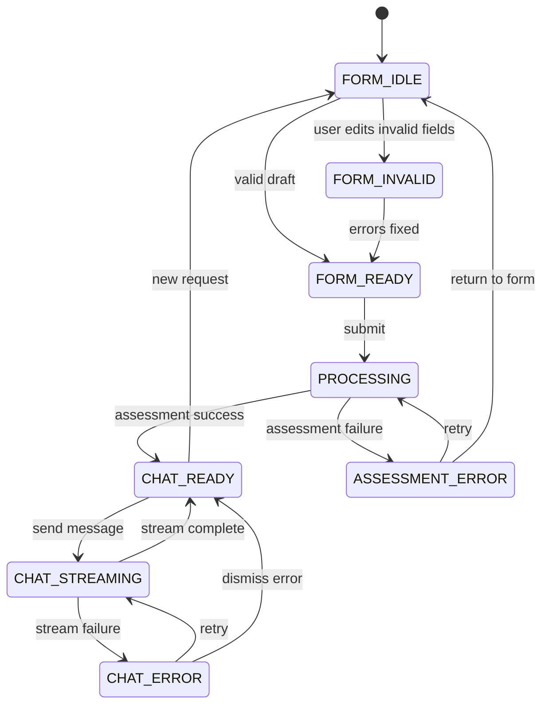
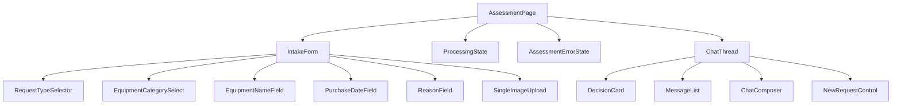
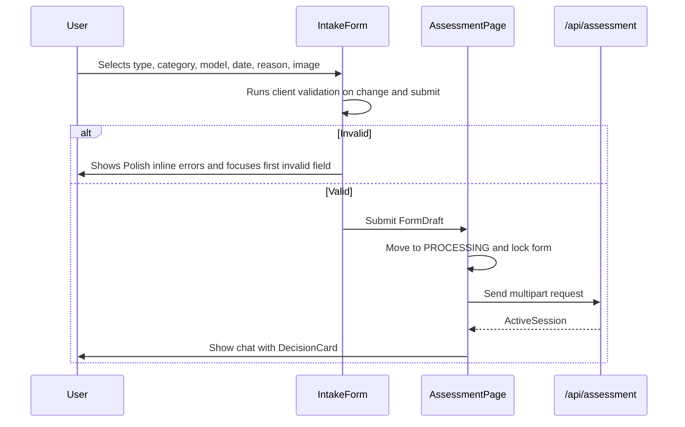
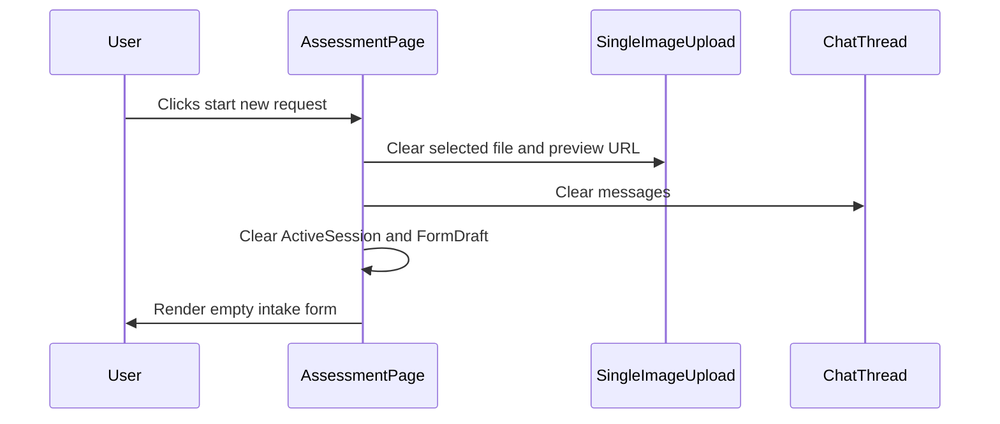

# ADR-002: Frontend Session UI

**Date:** 2026-06-18
**Status:** Accepted
**Relates to:** `docs/ADR/000-main-architecture.md`

---

## 1. Scope

This ADR covers the browser experience: intake form, processing state, decision presentation, chat continuation, active-session state, Polish user-facing copy, and design-system application.

It does not define server validation internals or model prompt structure. Those are covered in `docs/ADR/001-ai-decision-pipeline.md` and `docs/ADR/003-api-validation-image-handling.md`.

---

## 2. Context7 References

| Library | Context7 Handle | Used for |
|---|---|---|
| Next.js | `/vercel/next.js` | App Router pages, Server/Client Component boundaries |
| React | `/reactjs/react.dev` | Client state and UI composition |
| Vercel AI SDK | `/vercel/ai` | AI SDK React chat hook and UI message stream handling |
| Tailwind CSS | `/tailwindlabs/tailwindcss.com` | Styling implementation with repository design tokens |
| shadcn/ui | `/shadcn-ui/ui` | Optional accessible form/control primitives if selected during scaffold |

---

## 3. Component Design

### Screen state machine

The frontend has one main flow with explicit states:

| State | Description | Allowed transitions |
|---|---|---|
| `FORM_IDLE` | Empty or partially filled intake form | `FORM_INVALID`, `FORM_READY` |
| `FORM_INVALID` | One or more visible validation errors | `FORM_READY`, `FORM_IDLE` |
| `FORM_READY` | All required fields valid and one image selected | `PROCESSING`, `FORM_INVALID` |
| `PROCESSING` | Submission locked; image and decision are being generated | `CHAT_READY`, `ASSESSMENT_ERROR` |
| `ASSESSMENT_ERROR` | No decision exists; retry or return to form | `PROCESSING`, `FORM_IDLE` |
| `CHAT_READY` | First decision card and chat composer visible | `CHAT_STREAMING`, `FORM_IDLE` |
| `CHAT_STREAMING` | Assistant response is streaming; sends are disabled or queued consistently | `CHAT_READY`, `CHAT_ERROR` |
| `CHAT_ERROR` | Latest chat turn failed; retry available | `CHAT_STREAMING`, `CHAT_READY`, `FORM_IDLE` |

### Components

| Component | Responsibility |
|---|---|
| `AssessmentPage` | Owns top-level state machine and active session |
| `IntakeForm` | Displays request type, category, model, purchase date, reason, upload, submit |
| `RequestTypeSelector` | Exactly two options: `Reklamacja` and `Zwrot` |
| `EquipmentCategorySelect` | Fixed PRD category list |
| `PurchaseDateField` | Date picker/input; blocks future dates |
| `ReasonField` | Required indicator updates based on request type |
| `SingleImageUpload` | Accepts or replaces exactly one image; thumbnail and remove control |
| `ProcessingState` | Polish loading message while assessment is running |
| `AssessmentErrorState` | Polish retryable error without partial decision |
| `DecisionCard` | Renders structured decision result in required order |
| `ChatThread` | Renders first assistant message plus follow-up messages |
| `ChatComposer` | Sends free-text user messages through AI SDK UI flow |
| `NewRequestControl` | Clears active session and returns to empty form |

### State ownership

`AssessmentPage` owns:

- current screen state
- validated form draft
- selected image preview object URL
- `ActiveSession` after successful assessment
- chat messages for the current session

No frontend state is persisted to local storage, session storage, IndexedDB, cookies, or server storage for the MVP.

---

## 4. Data Structures

### FormDraft

Purpose: mutable client-side state before submission.

Fields:

- request type
- equipment category
- equipment name/model
- purchase date
- reason
- selected image file
- per-field validation errors

### FieldError

Purpose: one visible Polish error per invalid field.

Fields:

- field key
- Polish message
- severity fixed to blocking for this MVP

### DecisionCardViewModel

Purpose: UI-ready representation of `DecisionResult`.

Fields:

- greeting
- decision label in Polish
- decision status tone
- justification
- next steps
- missing information, if any
- conditions, if any
- disclaimer

Decision tone mapping:

| Decision | Visual tone |
|---|---|
| `APPROVE` | positive |
| `REJECT` | negative |
| `NEEDS_MORE_INFO` | warning/information |
| `CONDITIONAL` | warning |
| `ESCALATE` | neutral/escalation |

### ChatMessage

Purpose: AI SDK-compatible message shown in the chat thread.

Fields:

- id
- role
- parts or text content
- status for pending/streaming/error turns

The first assistant message is created from `DecisionResult` and inserted before user follow-up messages.

---

## 5. Interface Contracts

### Intake form submission

The UI submits only when all client validation passes:

- request type selected
- category selected
- model name trimmed non-empty
- purchase date present and not future
- reason trimmed non-empty when request type is `COMPLAINT`
- exactly one image selected
- image MIME type is JPEG, PNG, or WebP
- image size is at most 10 MB

Client validation mirrors server validation but server validation remains authoritative.

### Decision card rendering

The first assistant message must show sections in this order:

1. greeting
2. decision status label
3. justification
4. next steps
5. disclaimer

The status label must be visually distinguishable before the user reads the full message.

### Chat submission

When the user sends a chat message:

- the latest `ActiveSession` is sent with the message history
- the original image file is never sent again
- while a response is streaming, the UI must either disable sending or queue exactly one pending send; the implementation must choose one behavior and test it
- failed chat turns show a retry control tied to that turn

### New request

The `new request` action:

- clears `FormDraft`
- clears selected image and preview object URL
- clears `ActiveSession`
- clears chat messages
- returns the state machine to `FORM_IDLE`

---

## 6. Technical Decisions

### Use one page with state-driven screens

**Status:** Accepted
**Date:** 2026-06-18

**Context:** The PRD defines a linear form-to-chat journey with no history page and no navigation beyond starting over.

**Decision:** Implement the flow as one main page with state-driven rendering instead of multiple navigable pages.

**Rejected alternatives:**

- Separate `/form` and `/chat` routes: would imply route-level persistence or URL reconstruction not required by the PRD.
- Modal-only flow: unsuitable for mobile and harder to test.

**Consequences:**

- (+) Session reset behavior is simple and explicit.
- (+) No route persistence accidentally survives reload.
- (-) Browser refresh intentionally loses the chat.

**Review trigger:** Revisit if session resume or shareable case links are added.

### Use AI SDK React for chat continuation

**Status:** Accepted
**Date:** 2026-06-18

**Context:** The user requested AI SDK UI components, and the PRD requires a chat interface with streaming/thinking state and retry behavior.

**Decision:** Use AI SDK React/UI message primitives for chat state and streaming integration, while rendering custom components that match the repository design guidelines.

**Rejected alternatives:**

- Fully custom streaming parser and state management: more code and higher risk for no MVP benefit.
- Non-streamed chat replies only: does not satisfy the expected agent thinking/streaming UX.

**Consequences:**

- (+) Chat integration aligns with Vercel AI SDK docs.
- (+) UI can preserve typed message parts where useful.
- (-) The frontend must adapt AI SDK message structures to the custom decision card.

**Review trigger:** Revisit if AI SDK UI APIs change incompatibly during scaffold.

### Keep all user-facing text in Polish

**Status:** Accepted
**Date:** 2026-06-18

**Context:** The PRD and repository instructions require all product text to be Polish.

**Decision:** Store labels, validation messages, fixed disclaimers, status labels, and empty/error states in Polish copy constants. Tests must fail when required copy is missing or English user-facing text appears in core flows.

**Rejected alternatives:**

- Inline ad hoc strings in components: makes consistency and testing harder.
- English-first UI with later translation: violates AC-31.

**Consequences:**

- (+) Easier review for Polish language compliance.
- (+) Copy can be refined independently from layout.
- (-) Tests need an allowlist for technical enum values that are not displayed directly.

**Review trigger:** Revisit if multilingual UI enters scope.

### Render first decision from structured data

**Status:** Accepted
**Date:** 2026-06-18

**Context:** AC-21 requires exact section order and AC-22 requires visually distinguishable status.

**Decision:** Render the first assistant message from `DecisionResult` fields. Do not parse Markdown from the model for the decision card.

**Rejected alternatives:**

- Display raw model Markdown: section order and status labeling become unreliable.
- Hide structured data and store only text: chat context becomes harder to validate.

**Consequences:**

- (+) Accessibility and layout can be tested deterministically.
- (+) Status colors and labels map directly from enum values.
- (-) Model output must include all fields needed by the card.

**Review trigger:** Revisit if future AI SDK UI message parts provide a better native structured card mechanism.

### Use design tokens without building a marketing landing page

**Status:** Accepted
**Date:** 2026-06-18

**Context:** The repository has Spotify-inspired design tokens, but the PRD asks for a functional tool, not a landing page.

**Decision:** The first viewport is the actual intake tool. Styling uses the dark high-contrast token system, compact form controls, clear status labels, and responsive layout.

**Rejected alternatives:**

- Marketing hero page: delays the primary user task and violates the app-first requirement.
- Generic unstyled form: ignores the provided design guidelines.

**Consequences:**

- (+) The app is immediately usable during demos.
- (+) Visual consistency is anchored to existing assets.
- (-) Spotify-inspired aesthetics must be adapted carefully to a service workflow, not copied as a music product.

**Review trigger:** Revisit if a public marketing site becomes a separate requirement.

---

## 7. Diagrams

### Component / State Diagram

### Component Diagram

### Sequence Diagrams

#### Client-side validation and submit

#### New request clearing

---

## 8. Testing Strategy

### Test scenarios for this area

| Scenario | Type | Input | Expected output | Edge cases |
|---|---|---|---|---|
| Request type selector | Component | User toggles return/complaint | Exactly two Polish options; reason required state updates | Switching back to return makes reason optional |
| Category selector | Component | Open selector | Exact PRD category list | No extra categories |
| Future date | Component | Tomorrow's date | Polish inline error and blocked submit | Timezone boundary |
| Missing complaint reason | Component | Complaint with blank reason | Polish inline error | Whitespace-only reason |
| Single image upload | Component | Two images selected sequentially | One image retained by replace or block behavior | Remove control clears image |
| Decision card order | Component | Valid `DecisionResult` | Greeting, decision, justification, next steps, disclaimer in order | Needs-more-info and conditional sections |
| Assessment error | Component | Mock assessment failure | Retry and return-to-form controls; no decision card | Retry success |
| Chat streaming | Component/integration | User sends message | Streaming state visible; composer behavior consistent | Provider error |
| New request | Component | Active session exists | Form and chat state cleared | Preview URL cleanup |
| Polish copy | Unit/component | Core UI rendered | No user-facing English in labels/errors/core states | Technical enum values not directly displayed |

### Technical acceptance criteria

- TAC-002-01: The first visible screen is the intake form, not a landing page.
- TAC-002-02: The form fields appear in the order specified by PRD section 9.1.
- TAC-002-03: Submit is blocked unless the selected request type's required fields and one image are valid.
- TAC-002-04: The first chat message renders from structured `DecisionResult` fields in the required section order.
- TAC-002-05: Starting a new request clears form state, image preview, active session, and chat messages.
- TAC-002-06: Reloading the browser does not restore the previous session.
- TAC-002-07: Chat requests never include the original image file after the assessment call.
- TAC-002-08: All labels, validation errors, loading messages, decision card text, retry states, and chat system messages visible to users are Polish.
