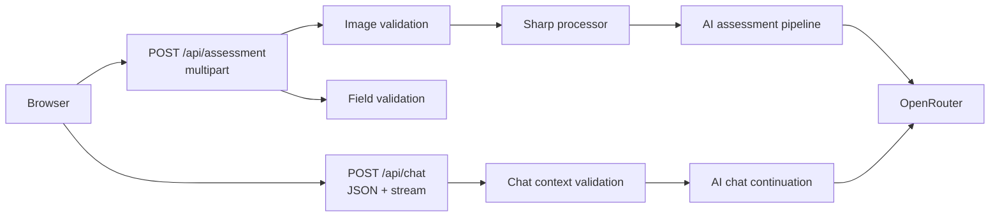
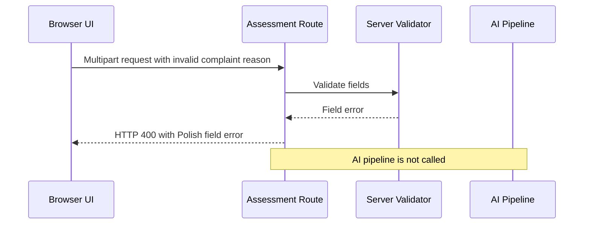
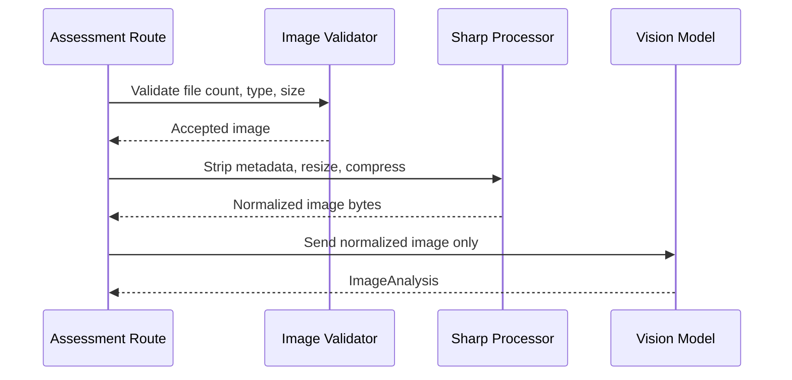
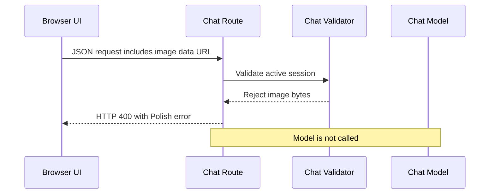

# ADR-003: API Validation and Image Handling

**Date:** 2026-06-18
**Status:** Accepted
**Relates to:** `docs/ADR/000-main-architecture.md`

---

## 1. Scope

This ADR covers server Route Handler contracts, server-side validation, image validation/compression, request/response error semantics, privacy constraints, and API-level tests.

It does not cover detailed prompt content or frontend component layout. Those are covered in `docs/ADR/001-ai-decision-pipeline.md` and `docs/ADR/002-frontend-session-ui.md`.

---

## 2. Context7 References

| Library | Context7 Handle | Used for |
|---|---|---|
| Next.js | `/vercel/next.js` | App Router Route Handlers and server environment access |
| Vercel AI SDK | `/vercel/ai` | Streaming response format for chat route |
| Sharp | `/lovell/sharp` | Image metadata stripping, resizing, compression |
| Vitest | `/vitest-dev/vitest` | Route and validation tests |
| Playwright | `/microsoft/playwright` | Browser E2E around upload/error flows |

---

## 3. Component Design

### Route Handlers

| Route | Responsibility |
|---|---|
| `POST /api/assessment` | Validate multipart form, normalize fields, validate and compress image, call AI pipeline, return initial active session |
| `POST /api/chat` | Validate active session and latest message, stream assistant reply using AI SDK-compatible response |

No other API routes are required for the MVP.

### Server validators

| Validator | Responsibility |
|---|---|
| Assessment field validator | Required fields, enum values, date rules, reason conditionality |
| Image validator | File count, MIME type, magic/signature where practical, size limit |
| Chat request validator | Active session shape, message history shape, latest user message, no image bytes |
| Env validator | Required OpenRouter variables and model separation |

### Image processor

Server image processing must:

- accept only JPEG, PNG, and WebP input
- reject files larger than 10 MB before compression
- strip metadata before model submission
- resize the longest edge to at most 1600 pixels
- encode with a quality setting suitable for LLM vision while reducing payload size
- keep the processed image only in memory for the current request

The compressed output is not shown to the user and is not persisted.

---

## 4. Data Structures

### AssessmentRequest

Transport: `multipart/form-data`

Fields:

| Field | Type | Required | Constraints |
|---|---|---|---|
| `requestType` | string | Yes | `RETURN` or `COMPLAINT` |
| `equipmentCategory` | string | Yes | Exact PRD category value |
| `equipmentName` | string | Yes | Trimmed non-empty |
| `purchaseDate` | string | Yes | ISO date; not future relative to server date |
| `reason` | string | Conditional | Required and trimmed non-empty for `COMPLAINT`; optional for `RETURN` |
| `image` | file | Yes | Exactly one JPEG, PNG, or WebP; max 10 MB |

### AssessmentSuccessResponse

Fields:

- `sessionId`
- `assessmentInput` without image binary
- `imageAnalysis`
- `initialDecision`
- `firstAssistantMessage`

### ValidationErrorResponse

Fields:

- `errorCode`
- `message` in Polish for UI display
- `fieldErrors`, keyed by field when applicable
- no model output
- no partial decision

### ServiceErrorResponse

Fields:

- `errorCode`
- `message` in Polish for UI display
- `retryable`
- no provider stack trace
- no partial decision

### ChatRequest

Transport: JSON

Fields:

- `activeSession` containing assessment facts, image analysis, initial decision, and first assistant message
- `messages` in AI SDK-compatible UI message shape
- latest user message included in `messages`

Constraints:

- no image file, image bytes, or image data URL may appear in chat requests
- `activeSession.initialDecision.decision` must be a valid decision enum
- `activeSession.imageAnalysis.summary` must be present

---

## 5. Interface Contracts

### `POST /api/assessment`

Success:

- HTTP 200
- JSON body matching `AssessmentSuccessResponse`
- `firstAssistantMessage` is ready to render as the first chat assistant message

Validation failures:

| Condition | Error behavior |
|---|---|
| Missing request type | Field error for request type |
| Invalid request type | Field error naming the two allowed options in Polish |
| Missing category | Field error for category |
| Category outside PRD list | Field error naming valid category requirement |
| Blank equipment name | Field error for model/name |
| Future purchase date | Field error explaining future dates are not allowed |
| Complaint without reason | Field error explaining defect description is required |
| No image | Field error explaining one image is required |
| More than one image | Reject or accept only one according to UI behavior; server must never process multiple images |
| Unsupported image format | Error naming JPEG, PNG, and WebP |
| File larger than 10 MB | Error stating the 10 MB limit |

AI/provider failures:

- If vision analysis fails, return retryable service error and do not call decision generation.
- If decision generation fails or produces invalid output after retry, return retryable service error and no decision.
- If image analysis succeeds but indicates insufficient evidence, decision generation may return `NEEDS_MORE_INFO`.

### `POST /api/chat`

Success:

- HTTP 200 stream compatible with AI SDK UI handling
- streamed assistant response in Polish

Validation failures:

| Condition | Error behavior |
|---|---|
| Missing active session | HTTP 400 with Polish retry/start-over message |
| Missing image analysis in context | HTTP 400; no model call |
| Invalid initial decision enum | HTTP 400; no model call |
| Missing latest user message | HTTP 400; no model call |
| Image bytes included in chat request | HTTP 400; no model call |

Provider failures:

- Return or surface a retryable chat turn error.
- Do not append a failed assistant reply to the durable browser message list.

---

## 6. Technical Decisions

### Use multipart for initial assessment and JSON for chat

**Status:** Accepted
**Date:** 2026-06-18

**Context:** Initial assessment includes a binary image file, while chat continuation only needs text/session context.

**Decision:** `/api/assessment` accepts `multipart/form-data`; `/api/chat` accepts JSON and returns a stream.

**Rejected alternatives:**

- Base64 image inside JSON for assessment: increases payload size and complicates validation.
- Multipart chat requests: unnecessary because the image is never resent after initial analysis.

**Consequences:**

- (+) Upload handling stays explicit and localized.
- (+) Chat payloads remain text-only after assessment.
- (-) Tests need separate helpers for multipart and JSON route calls.

**Review trigger:** Revisit if multiple images or video enter scope.

### Validate on both client and server

**Status:** Accepted
**Date:** 2026-06-18

**Context:** The PRD requires client-side and server-side validation. Client validation improves UX; server validation protects route correctness.

**Decision:** Implement shared validation rules where practical, with server validation as the authoritative gate before image processing or AI calls.

**Rejected alternatives:**

- Client-only validation: unsafe and bypassable.
- Server-only validation: worse UX and fails inline validation expectations.

**Consequences:**

- (+) Fast inline feedback and robust server protection.
- (+) Unit tests can exercise validation rules without model calls.
- (-) Validation rules must be kept in sync across UI and server.

**Review trigger:** Revisit if validation rules become complex enough to justify a shared schema package.

### Normalize and compress images server-side before model calls

**Status:** Accepted
**Date:** 2026-06-18

**Context:** AC-10 requires backend compression before sending the image to the multimodal model.

**Decision:** Use Sharp to strip metadata, resize longest edge to at most 1600 pixels, and encode with compression before sending to OpenRouter.

**Rejected alternatives:**

- Client-only compression: cannot satisfy backend compression requirement and is easier to bypass.
- Send original image to model: increases cost, latency, and privacy exposure.

**Consequences:**

- (+) Smaller model payloads and no metadata leakage.
- (+) Deterministic processing can be tested.
- (-) Serverless memory and CPU use must be monitored.

**Review trigger:** Revisit if images frequently fail due to compression artifacts or serverless resource limits.

### Never persist uploaded images or transcripts

**Status:** Accepted
**Date:** 2026-06-18

**Context:** The MVP excludes database persistence and should minimize privacy risk.

**Decision:** Process images in memory only, send compressed bytes to the model, and discard them before returning the response. Do not store chat transcripts server-side.

**Rejected alternatives:**

- Temporary disk storage: unnecessary and increases cleanup risk.
- Persist cases for review: explicitly out of scope.

**Consequences:**

- (+) Lower privacy and operational burden.
- (+) Aligns with anonymous session constraint.
- (-) Failed requests cannot be audited after the fact.

**Review trigger:** Revisit if staff handoff, audit trails, or legal retention requirements are introduced.

### Fail closed on AI errors and invalid output

**Status:** Accepted
**Date:** 2026-06-18

**Context:** AC-29 and AC-30 require explicit error states and prohibit fabricated decisions.

**Decision:** Provider errors, unusable provider responses, and invalid structured decisions produce retryable errors rather than fallback decisions.

**Rejected alternatives:**

- Heuristic fallback decision: risks false approvals/rejections.
- Convert provider failures to `NEEDS_MORE_INFO`: misrepresents a technical failure as missing user evidence.

**Consequences:**

- (+) Honest error handling.
- (+) Clear distinction between insufficient evidence and service failure.
- (-) Temporary provider outages block decisions.

**Review trigger:** Revisit if the product adds offline/manual fallback workflows.

---

## 7. Diagrams

### Component / Boundary Diagram

### Sequence Diagrams

#### Validation blocks invalid assessment before AI calls

#### Image processing before vision model

#### Chat request rejects image bytes

---

## 8. Testing Strategy

### Test scenarios for this area

| Scenario | Type | Input | Expected output | Edge cases |
|---|---|---|---|---|
| Valid return assessment request | Integration | Multipart return request with JPEG | HTTP 200 with `ActiveSession` | Mock vision and chat models |
| Valid complaint assessment request | Integration | Multipart complaint request with reason | HTTP 200 with complaint policy path used | Reason whitespace trimming |
| Future date | Unit/integration | Purchase date after server date | HTTP 400 field error | Timezone near midnight |
| Unsupported file | Unit/integration | PDF or HEIC file | HTTP 400/415 typed error naming JPEG, PNG, WebP | Spoofed MIME when detectable |
| Oversized file | Unit/integration | File over 10 MB | HTTP 400/413 typed error stating limit | Exactly 10 MB allowed |
| Multiple files | Integration | Two files in assessment | Server processes no more than one; behavior matches chosen UI rule | Duplicate field names |
| Image compression | Unit | Large valid image | Longest edge at most 1600 px and metadata stripped | PNG/WebP input |
| Vision provider failure | Integration | Mock OpenRouter failure | Retryable service error, no decision model call | Timeout |
| Invalid decision output | Integration | Mock invalid enum | Retry once, then error if still invalid | Missing disclaimer |
| Chat context missing | Integration | No image analysis | HTTP 400, no model call | Invalid decision enum |
| Chat contains image bytes | Integration | Data URL in chat context | HTTP 400, no model call | Nested message part |

### Technical acceptance criteria

- TAC-003-01: `/api/assessment` rejects invalid input before image processing or AI calls.
- TAC-003-02: `/api/assessment` rejects unsupported formats with a Polish message naming JPEG, PNG, and WebP.
- TAC-003-03: `/api/assessment` rejects images larger than 10 MB before compression.
- TAC-003-04: Valid images are compressed server-side before being sent to the vision model.
- TAC-003-05: Image metadata is stripped before model submission.
- TAC-003-06: The original uploaded image is never persisted to disk, database, logs, or chat context.
- TAC-003-07: `/api/chat` rejects requests that include image bytes or image data URLs.
- TAC-003-08: Provider failures return retryable error states and never produce fabricated decisions.
- TAC-003-09: Route tests prove that invalid validation requests do not call mocked OpenRouter clients.
- TAC-003-10: Route tests prove separate OpenRouter model IDs are used for vision and chat/decision calls.
